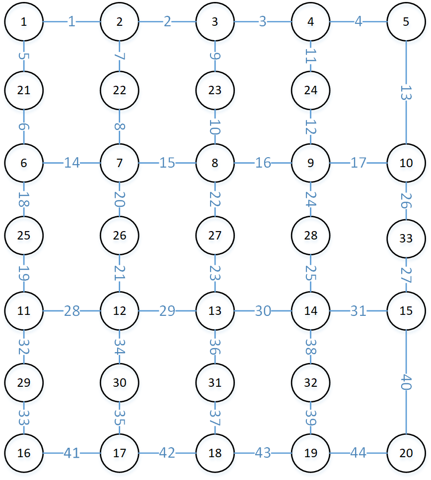

# QLearning for Path Planning

This is a realization of the Q-Learning algorithm for path planning (Code + Description). Here is the file structure:

```
QLearning for Path Planning
    |-- src
        |-- data
            |-- Distance.mat
            |-- Distance_bigmap.mat
            |-- NodeSide.mat
            |-- NodeSide_bigmap.mat
        |-- Planned
            |-- PlannedData.mat
            |-- PlannedData_bigmap.mat
        |-- GetBigmapMat.m
        |-- main.m
        |-- mygetRealObstacle.m
        |-- mygetRewardTable.m
        |-- mygetRoutelen.m
        |-- myQLearningRoute.m
        |-- myQLearningTrain.m
        |-- myRouteChange.m
        |-- time_test.m
    |-- imgs
        |-- images used in file 'Readme.md'
    |-- Readme.md
```

Among the files above:
- folder 'src' contains data and codes needed in this project;
  - folder 'data' contains source data;
    - file 'Distance.mat' is a matrix representing the distance between the Direct Connectable Points in an undirected graph abstracted from the map;
    - file 'Distance_bigmap' is a matrix representing the same thing abstracted from a larger map;
    - file 'NodeSide.mat' is a matrix representing the undirected graph abstracted from the map;
    - file 'NodeSide_bigmap.mat' is a matrix representing the same thing abstracted from a larger map;
  - folder 'Planned' contains data of well planned routes;
    - file 'PlannedData.mat' is a structure containing data of well planned routes in 100 experiments on the smaller map;
    - file 'PlannedData_bigmap.mat' is a structure containing data of well planned routes in 100 experiments on the larger map;
  - file 'GetBigmapMat.m' is to get the matrix representation of a undirected graph for the 40-row, 50-column map, with its nodes' and edges' ID marked;
  - file 'main.m' is the main function of this project;
  - file 'mygetRealObstacle.m' is to pick out newly added obstacled sections on the previously planned route;
  - file 'mygetRewardTable.m' is to get the REWARD TABLR according to user's settings;
  - file 'mygetRoutelen.m' is to calculate the length of the input route;
  - file 'myQLearningRoute.m' is to get route calculated from the trainned Q_table through Q-learning algorithm;
  - file 'myQLearningTrain.m' is to train Q_table through Q-learning algorithm;
  - file 'myRouteChange.m' is to re-plan the route when the previosuly planned route does not work;
  - file 'time_test.m' is a file to analyse the time consumed by path planning with the Q-Learning algorithm.
- folder 'imgs' contains images used in file 'Readme.md';


Then, how to run this project? Here is the guide:

First, add these files to your MATLAB path, open file 'main.m' and click the 'run' button.
Then, you will get the XXX.MAT file in folder 'Planned', which is the result of the path plannning problem using QLearning algorithm.

Let's just read ONE SINGLE LINE in 'PlannedData.mat', here is it:

<center>Fig1 result of the path planning with QLearning algorithm</center>

Here we can see ——
```
start_state:            POINT 1
final_state:            POINT 30
obstacle:               [14;28;34;37]
route:                  [1,21,6,25,11,29,16,17,30]
routelen:               165.5
obstacle_add:           [3;8;17;33;38]
obstacle_add_at_route:  33
new_route:              [29,11,25,6,21,1,2,3,23,8,27,13,14,15,20,19,18,17,30]
wait_thresh:            465
```

Data above tells us such a story:

There was a robot (term 'agent' in Reinforcement learning, RL) at POINT 1 and it wanted to go to POINT 30, it had alreadly known the map (term 'environment') as follows:

<center>Fig2 the map</center>

On the map, there are several obstacled sections: [14;28;34;37]
Under this circumstance, the robot found a nearest route with the help of QLearning algorithm: Go from POINT 1 to POINT 21, then to POINT 6, 25, 11, 29, 16, 17, and finally to POINT 30.
Wow, great! WELL DOWN!
Wait, wait, ... we've got a problem, however. For some unaccountable reason, the obstacled sections increased——we now have 5 more obstacled ones: [3;8;17;33;38]. And, the worse news is that, one of them, accurately speaking, route __33__ cut off the well-planned route: [1,21,6,25,11,29,16,17,30], which means we have no choice but to re-plan the route again.

Okay, fine~ Let's just redo the work!
Again, thanks to the QLearning algorithm, another way was found: [29,11,25,6,21,1,2,3,23,8,27,13,14,15,20,19,18,17,30]. The reason we start from POINT 29 instead of POINT 1 is that we want to simulate situations in real scenes where the agent might have moved for a while when the accidents happened.

The whole process can be described by a graph as follows:

<center>Fig3 the whole process of path planning and route change</center>

Here is how QLearning works for the Path Planning problem. What's more, here are some tips you need to know.

- First, path planning for the larger 40*50 map is extremely time-consuming, one single experiment can take hundreds of seconds like that:

<center>Fig4 time consumed of one single experiment</center>

- Second, there are some hyperparameters in QLearning, you can choose them basing on your experience. For example, for the larger map, make episode = 200 is a good choice, If episode should be too large, it will cause the waste of calculation power as follows:

<center>Fig5 value of parameter 'episode' is too big (1000), causing calculation power waste</center>

Here is the whole story, if tou have any question, welcome to contact me.
